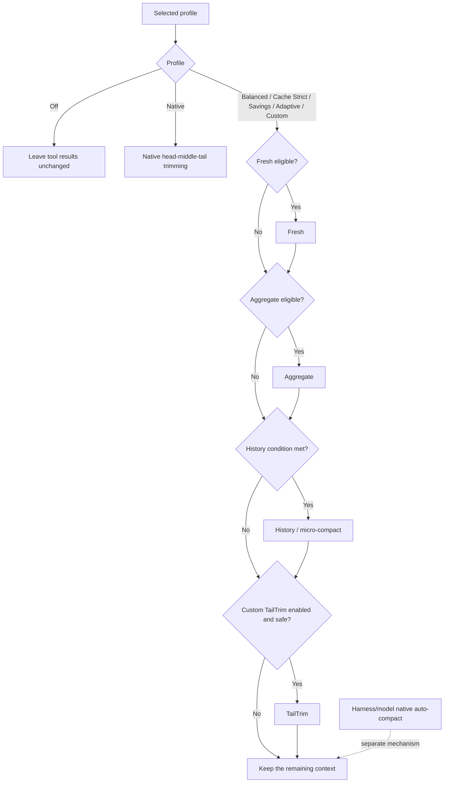

# dsh-context-compression-selector

> An auditable tool-result context-compression selector for DeepSeek Harness.

[中文说明](README.zh.md) · [Report an issue](https://github.com/xbzb404/dsh-context-compression-selector/issues)

> [!NOTE]
> **This repository is a personal fork**, derived from the original
> `dsh-context-compression-selector` project and maintained here as a standalone
> personal repository. The original project, its design, and its companion
> courseware are the work of the upstream author; the MIT license and its terms
> carry over unchanged.

> [!NOTE]   
> **What's new in 0.2.0-rc.1:**
>
> - **Ported to Harness `0.2.0-rc.2`.** Compression now ships as **derived preset variants** (`<preset>--compression`) declared through the 0.2.0 `AgentPresetRegistry`, replacing the `0.1.x` path-decoration overlay. Your original presets are never rewritten.
> - **Settings are served by the profile row itself.** The Bundle's row id is `context-compression`, which is also its settings namespace, so the browser selector reads exactly the form that row declares.
> - **DeepSeek-V4.1-Flash is supported on the Harness default route.** `deepseek-flash` resolves an exact bundled tokenizer instead of failing closed, so exact-gated compression is no longer a no-op on the default model.
> - Vision image-token arithmetic is re-ported to the official V4.1 image processor: the per-image cap moves 384 → 1024, the minimum-pixel floor 147456 → 295936, and the aspect clamp is gone.
>
> See [CHANGELOG.md](CHANGELOG.md) for the full release history.

> [!IMPORTANT]
>   
> This project currently supports **DeepSeek models only**. Its lossless measurement and lossy tool-result compression depend on the bundled official DeepSeek tokenizers. The exact supported model IDs in this release are `deepseek-flash`, `deepseek-v4-flash`, `deepseek-v4-pro`, and `deepseek-v4-flash-vision-exp`. Other DeepSeek Harness models, including non-DeepSeek providers, fail open and retain their original tool results.

## What it is

Long-running agent tasks can accumulate a large amount of tool output. This community plugin adds selectable, auditable policies for reducing that tool-result context without modifying DeepSeek Harness core.

- **Fresh** pre-compresses a newly oversized tool-result segment before the model receives it.
- **Aggregate** pre-compresses fresh material again when it still grows beyond its configured budget.
- **History / micro-compact** replaces eligible old tool results while preserving recent working context.
- **TailTrim** is an optional Custom-only tail reduction path.
- **Native** preserves the original Harness-style head/middle/tail tool-result trimming as one explicit profile.

The plugin records the selected policy and each decision: stage, reducer, trigger, skip reason, and exact token counts where available.

## Settings UI

Choose a compression profile from DeepSeek Harness settings, and set the Auto Compact trigger level in the same section. Settings are frozen when a session first observes them, so changing a setting affects new sessions rather than silently changing an active task.

The Bundle's `cordis.patch.yml` inserts exactly one profile row, and its id — `context-compression` — **is** the settings namespace. Harness `0.2.0` serves one settings form per profile-row entry id, so the row you install is the form the browser reads; there is no second document to keep in sync. If you rename the row, rename `CONTEXT_COMPRESSION_SETTINGS_NAMESPACE` with it or the form is orphaned.

### How compression reaches a session (`0.2.0`)

Harness `0.2.0` makes `AgentPresetRegistry` the single authority for preset composition: a preset is declared by its owner (`register({ id, plugins })`) and discovery no longer walks directories. A plugin therefore cannot decorate someone else's preset in place, and the `0.1.x` overlay mechanism is gone.

Instead, the Bundle declares **derived variants**: for every preset the registry already lists, the plugin registers a sibling with the id `<source>--compression` and the name `<source name> · Context compression`, whose entry list is the source's own rows with the compression stack appended. Because the Host's own declarations carry no description, each variant also carries its own: what it adds over the native preset and the Auto Compact threshold that generation froze. Variants are published once per distinct compression configuration and are reference-counted, so the built-in row and the Bundle row never install two compression stacks; disposing the row withdraws exactly the variants it registered. Presets the plugin excludes — and presets it marked `broken` — get no variant.

Pick the variant preset (for example `standard--compression` instead of `standard`) in your profile to run compression. The source preset keeps working untouched next to it.

The variants exist because the compression runtime has to live inside the same scope group as the compactor that consumes it: it provides `toolResultPruner`, and `dsh-compaction` only resolves that service from its own isolated realm. Mounting the runtime at the root does not reach it — the preset composition is the only supported path.

### Auto Compact threshold

The selector settings section exposes `autoCompact.thresholdPercent`: an integer between 50% and 90% (step 1%), defaulting to 80%. Enter any valid value, such as 73%, directly in the field. Values outside the recommended 70–85% band show a risk note but remain savable. The level is written into the generated `compaction-basic` composition as `thresholdRatio` and, from the same read, into the plugin runtime's deployment config, so one standing generation can never run Auto Compact and micro compact on two different thresholds. It rescales the standard-profile History trigger, minimum reclaim, recent-token tail, and the micro-compact last-chance deadline `D = floor(A × 0.875)` around `A = floor(C × a)`, where `a = thresholdPercent / 100` is used as a floating-point ratio — the same arithmetic order `compaction-basic` itself uses. At the default 80% on a 1M context the previous numbers are reproduced exactly. Fresh, Aggregate, Native single-result budgets, the 10-call working set, and the Auto Compact retain ratio are unchanged in this release; Custom stays manual.


## Who should use it

This is an advanced plugin. It is not designed to be friendly to most users without background knowledge of agent context, tool-result compression, context windows, prompt caching, and the difference between deterministic tool-result compression and model-driven auto-compaction.

If those terms are unfamiliar, this plugin is likely not the right starting point. It explains the mechanisms, profiles, trade-offs, and practical usage of tool-result compression before you change any compression settings.

## Model support and safety

The runtime ships pinned official DeepSeek V4 tokenizer assets and verifies their SHA-256 hashes. Exact token measurement is a safety requirement: without it, the plugin does not perform a lossy rewrite.

| Model route                             | Served by             | Selector compression                                                                                                                   |
| --------------------------------------- | --------------------- | -------------------------------------------------------------------------------------------------------------------------------------- |
| `deepseek-flash`                        | `DeepSeek-V4.1-Flash` | Supported: exact text counting plus bounded image-token estimates; image-bearing rewrite candidates remain exact-ineligible and intact |
| `deepseek-v4-flash`                     | `DeepSeek-V4.1-Flash` | Supported                                                                                                                              |
| `deepseek-v4-flash-vision-exp`          | `DeepSeek-V4.1-Flash` | Supported: exact text counting plus bounded image-token estimates; image-bearing rewrite candidates remain exact-ineligible and intact |
| `deepseek-v4-pro`                       | `DeepSeek-V4-Pro`     | Supported                                                                                                                              |
| Other DeepSeek model IDs                | —                     | Not supported; fail open                                                                                                               |
| Non-DeepSeek models in DeepSeek Harness | —                     | Not supported; fail open                                                                                                               |

The V4.1-Flash routes are served by a bundled official tokenizer pinned at `deepseek-ai/DeepSeek-V4.1-Flash` revision `dba1be0a40aa45a94ad051997016db3960a90277`; `deepseek-v4-pro` keeps its own separately pinned `deepseek-ai/DeepSeek-V4-Pro` tokenizer. The two vocabularies are deliberately never treated as aliases of each other. Vision image tokens use a line-by-line port of the official V4.1 image processor (patch size 14, downsample ratio 3, 1024-token cap, min pixels 295936, and no aspect clamp because the official config pins `max_wh_ratio` to `null`), validated against golden fixtures generated by executing the official Python implementation. The V4.1 block length is exactly `nLlmH * (nLlmW + 1) + 2` and carries no alignment padding, so it does not depend on the absolute serialized position. A valid image is reported as `tokenizer-estimate` at that block length, with 1024 tokens retained as the per-image conservative upper bound. If dimensions are malformed or cannot be evaluated, the plugin charges a fixed 256-token fallback instead of making the visual surface unavailable. These values are deliberately approximate because the adapter's final request-image projection — including per-route pixel-budget overrides and byte-cap reprojection — is not exposed through the current measurement seam; an 800×800 upload projected to 512×512 can therefore differ materially from its intrinsic estimate. The estimate improves pressure accounting but never authorizes a lossy rewrite: image-bearing tool-result candidates remain exact-ineligible and are never rewritten, deleted, or counted as zero. Exposing projected dimensions upstream would allow a later exact counter.

“Fail open” means the original tool result remains in context and an auditable skip or failure record is emitted. The selector does not estimate tokens with character counts and must not be treated as a generic multi-provider compressor.

## Pre-compression and historical compression are different

**Fresh and Aggregate are pre-compression, not History compression.** They reduce a newly produced tool result before it is first sent to the model. The reducer selects a safe strategy from the tool name, command arguments, and content evidence—for example JSON, search, file read, Git, package, build, test, or shell output. Because this only bounds new material and does not rewrite the serialized prompt prefix already sent to the provider, it does not break an existing prompt cache.

**History / micro-compact is historical compression.** It selects old tool results outside the protected working set, then replaces each selected result in active context with a short, recoverable multi-line placeholder beginning `[Old tool result content cleared from active context]`. The placeholder retains the tool name, status, source reference, and retrieval instruction, while the original durable event remains recoverable. This intentionally rewrites an already-sent prefix, so it breaks or restarts the prompt cache. History protects the union of the newest 10 agent tool calls and the latest 64,000 tool-result tokens before it considers older results.

## How a profile is evaluated



An enabled mode is not guaranteed to run. Its trigger, safety checks, exact tokenizer availability, and required reclaim must all pass. For all selector profiles other than `native`, Harness-native head/middle/tail tool-result trimming is disabled so that the selector is the only tool-result compactor. Model-driven native auto-compaction remains a separate Harness/model mechanism and is only audited separately.

## Profiles

Profiles are orchestration policies, not separate compression algorithms. A profile composes the available methods by deciding which ones are enabled, their evaluation order, thresholds, retention set, minimum reclaim, and cache-safety trade-offs.

| Profile      | Fresh / Aggregate               | History                                                                                                                                      | Native tool trimming    | TailTrim                      |
| ------------ | ------------------------------- | -------------------------------------------------------------------------------------------------------------------------------------------- | ----------------------- | ----------------------------- |
| Off          | Disabled                        | Disabled                                                                                                                                     | Disabled                | Disabled                      |
| Native       | Disabled                        | Disabled                                                                                                                                     | Enabled (`4096 → 2048`) | Disabled                      |
| Balanced     | `8192 → 3072` / `32768 → 12288` | Routine at `500000`; retain 10 recent calls and a 64,000-token tail                                                                          | Disabled                | Disabled                      |
| Cache Strict | Same as Balanced                | Full-request last chance at `D = 700000`; once `D` is reached, the planner may run even when tool-result tokens are at or below `H = 600000` | Disabled                | Disabled                      |
| Savings      | `4096 → 1536` / `16384 → 4096`  | Routine at `400000`                                                                                                                          | Disabled                | Disabled                      |
| Adaptive     | Same as Balanced                | Conservative estimated routing at `500000`, with a capacity-pressure safety override                                                         | Disabled                | Disabled                      |
| Custom       | Configurable                    | Configurable                                                                                                                                 | Disabled                | Optional, disabled by default |


History protects the union of the newest 10 agent tool calls and the latest 64,000 tool-result tokens. Older eligible results are rewritten only when the policy can reclaim its required minimum. The History trigger, minimum-reclaim, and tail numbers in the table are the values at the default 80% Auto Compact level; they rescale with `A = floor(C × a)` (`a = thresholdPercent / 100`, floating-point ratio) once you change the threshold (see Auto Compact threshold above).

### Adaptive limitation and upstream capability request

The Adaptive profile is shown in the settings UI as **Conservative cost**. It is intentionally not a perfect adaptive cache optimizer: it makes a conservative estimate from the currently available request usage, model pricing, and same-tokenizer measurements, and fails closed when those inputs are incomplete. It cannot observe or control the exact cache breakpoint, cache allocation, or cache lifetime.

Perfect adaptive behavior requires DeepSeek to expose cache-breakpoint control and cache TTL/lifetime evidence. Those capabilities are not currently available to this plugin through public DeepSeek Harness or provider APIs. Upstream capability request: @deepseek-ai and [deepseek-ai/deepseek-harness](https://github.com/deepseek-ai/deepseek-harness).

## Compatibility

- Verified against DeepSeek Harness `0.2.0-rc.2` using public plugin and profile APIs only.
- Requires Node `^22.19.0 || >=24`.
- **Requires Harness `0.2.0-rc.2`.** This branch is **not** compatible with the `0.1.x` Harness line: the published `0.1.1` releases target `dsh-v0.1.1-rc.2`, while this working tree is ported to the `0.2.0-rc.2` public API surface (`AgentPresetRegistry.register()` preset variants, `SettingsForms.describe()` settings reads, `ConfigForms`-backed `settings.section`, `snapshotEvents()` / `inheritedEventCount` session reads, branded `SessionSeq`, and `Promise<Agent>` from `AgentLoop.create()`). Installing it into a `0.1.x` profile will fail to load.
- The project contains only this Bundle and its runtime; it does not vendor or modify DeepSeek Harness core.
- This is an unofficial community project and is not affiliated with or endorsed by DeepSeek.

## Development and security

Run the release-oriented local checks with:

```sh
pnpm run typecheck
pnpm run test
pnpm run test:built
pnpm run test:e2e:packed
pnpm run verify:release
```

See [CONTRIBUTING.md](CONTRIBUTING.md) for development expectations, [SECURITY.md](SECURITY.md) for vulnerability reporting, and [THIRD_PARTY_NOTICES.md](THIRD_PARTY_NOTICES.md) for bundled tokenizer provenance and licenses.

## Install

Install the single Bundle entry package into a Harness profile:

```sh
dsh plugin --profile <profile> add dsh-context-compression-selector@latest
dsh --profile <profile> --dump-config
```

The selector package declares the Harness Bundle manifest field `dsh.bundle.patch`, so `dsh plugin --profile <name> add <package>` is the standard DeepSeek Harness installation path for an out-of-tree Bundle. Its exact-version runtime dependency, `dsh-context-compression-selector-runtime`, is installed automatically; do not install or wire the two packages separately.

> **Version notice.** The published `latest` channel currently carries the **`0.1.1`** line, which targets Harness `dsh-v0.1.1-rc.2`. This branch is **`0.2.0-rc.1`** and targets Harness **`0.2.0-rc.2`**. It is a local working tree and is **not yet published**, so `@latest` will **not** give you this code. If your profile is on `0.2.0-rc.2`, install from source instead — see below.
>
> Do not install the `0.1.1` line into a `0.2.0-rc.2` profile (or the reverse): `0.1.1` decorates preset paths, which `0.2.0` removed, so it fails to load.

Restart the selected profile after installation. The config dump should list the selector Bundle as active.

To update or remove it:

```sh
dsh plugin --profile <profile> up dsh-context-compression-selector@latest
dsh plugin --profile <profile> remove dsh-context-compression-selector
```

### Install from source (local, unpublished build)

Use this when your Harness profile is on `0.2.0-rc.2` and you need the code in this working tree rather than the published `0.1.1`.

```sh
# 1. Build both packages (writes lib/) and pack them into local tarballs.
pnpm install
pnpm -r run bundle
cd packages/runtime  && pnpm pack --pack-destination ../../release-artifacts && cd ../..
cd packages/selector && pnpm pack --pack-destination ../../release-artifacts && cd ../..
```

This produces two files in `release-artifacts/`:

```
dsh-context-compression-selector-runtime-0.2.0-rc.1.tgz
dsh-context-compression-selector-0.2.0-rc.1.tgz
```

Then install them **together** into the target profile:

```sh
cd ~/.dsh/profiles/<profile>

# First pin the exact runtime dependency to the local tarball (required — see below).
# Append to pnpm-workspace.yaml:
#   overrides:
#     dsh-context-compression-selector-runtime: file:<abs-path>/release-artifacts/dsh-context-compression-selector-runtime-0.2.0-rc.1.tgz

pnpm add --registry=https://registry.npmmirror.com file:<abs-path>/release-artifacts/dsh-context-compression-selector-runtime-0.2.0-rc.1.tgz
pnpm add --registry=https://registry.npmmirror.com file:<abs-path>/release-artifacts/dsh-context-compression-selector-0.2.0-rc.1.tgz
```

#### Why the `overrides` entry is required

The selector declares its runtime dependency as an **exact** version (`"dsh-context-compression-selector-runtime": "0.2.0-rc.1"`), and that prerelease is **not published to npm**. The package manager re-resolves the whole dependency tree on every `add`, so:

- installing only the selector tarball looks up `0.2.0-rc.1` in the registry → `ERR_PNPM_NO_MATCHING_VERSION` (the registry only has the incompatible `0.1.1`);
- **installing the runtime first does not help** — the second `add` still re-resolves that exact version against the registry, with the same result;
- passing both tarballs in one command does not work either — pnpm prefers the registry and will not adopt the sibling tarball from the same invocation.

An `overrides` entry is the only supported way to pin the dependency locally without publishing. It must live in the profile's `pnpm-workspace.yaml`: **pnpm 11 no longer reads the `pnpm` field in `package.json`** and warns that it is ignored.

> **Note:** the path inside `overrides` is a host-absolute path, so it is not portable. Every user has to point it at their own extraction location.

#### One-shot script (recommended)

`scripts/install-from-tarballs.mjs` performs all of the above — writing the override, registering the Bundle, and verifying the result:

```sh
node scripts/install-from-tarballs.mjs --profile <profile>
```

It backs up `package.json` first, so a failure can be rolled back from the backup. Optional flags: `--registry <url>`, `--dry-run`.

#### Why `dsh plugin add github:owner/repo` does not work

Installing straight from GitHub fails for the same root cause: **pnpm resolves a git dependency's own dependencies from the registry only** and does no relative resolution inside the checkout. The selector's exact-version runtime dependency therefore still fails. (Everything before that step is already in place: the repository root is a workspace container whose `package.json` carries the `dsh.bundle` declaration, and build output is committed — only this one dependency resolution blocks it.)

Publishing the runtime to a registry is the only way to make that path work; until then, use the tarball flow above.

The selector registers itself through the Bundle manifest field `dsh.bundle.patch`, so it also has to appear in the profile's bundle list (`package.json` → `dsh.profile.bundles`) before a restart picks it up:

```sh
dsh --profile <profile> --dump-config
```

The config dump should list the selector Bundle as active.

The plugin uses only public Harness extension APIs and does not modify Harness core code.
