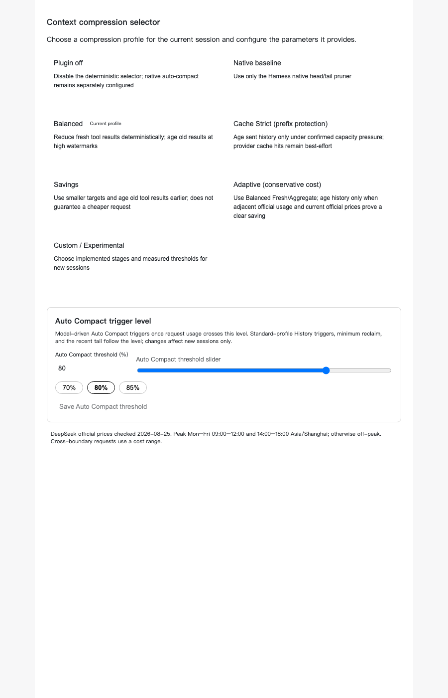
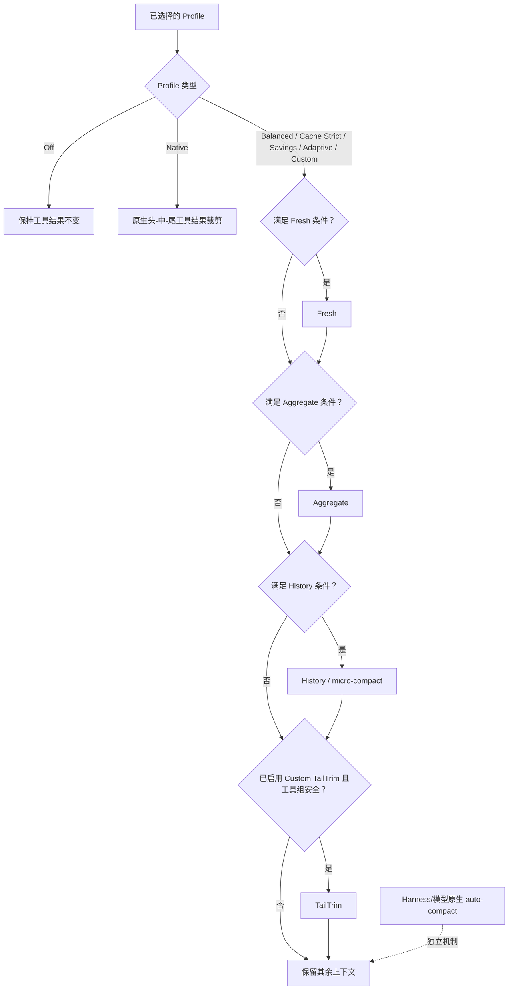

# dsh-context-compression-selector

> 面向 DeepSeek Harness 的、可审计的工具结果上下文压缩选择器。

[English README](README.md) · [提交问题](https://github.com/xbzb404/dsh-context-compression-selector/issues)

> [!NOTE]
> **本仓库是个人 fork**，派生自原 `dsh-context-compression-selector` 项目，
> 现作为个人仓库独立维护。原项目的设计、实现与配套课件均为上游作者的工作；
> MIT 许可证及其条款原样沿用。

> [!NOTE]
> **0.2.0-rc.1 更新内容：**
>
> - **已迁移到 Harness `0.2.0-rc.2`。** 压缩改为以**派生预设变体**（`<预设>--compression`）形式通过 0.2.0 的 `AgentPresetRegistry` 声明，取代 `0.1.x` 的路径装饰方案。**你原有的预设绝不会被改写。**
> - **设置由 Profile 行本身提供。** Bundle 插入的行 id 是 `context-compression`，它同时也是设置 namespace，因此浏览器端选择器读取的正是这一行声明的表单。
> - **现已支持 DeepSeek-V4.1-Flash，覆盖 Harness 默认路由。** `deepseek-flash` 可解析出随包提供的精确 tokenizer，不再安全降级为空转。
> - 视觉图片 token 算术已按官方 V4.1 image processor 重移植：每张图片上限 384 → 1024、最小像素 147456 → 295936，且取消了宽高比裁剪。
>
> 完整发布历史见 [CHANGELOG.md](CHANGELOG.md)。

> [!IMPORTANT]
> 本项目目前**只支持 DeepSeek 模型**。无损 token 测量与有损工具结果压缩依赖随包提供的 DeepSeek 官方 tokenizer。本版本精确支持的模型 id 为 `deepseek-flash`、`deepseek-v4-flash`、`deepseek-v4-pro` 和 `deepseek-v4-flash-vision-exp`。其他 DeepSeek Harness 模型（包括非 DeepSeek 提供商模型）会安全降级，保留原始工具结果。

## 它解决什么问题

长期运行的 Agent 任务会积累大量工具输出。本社区插件在不修改 DeepSeek Harness 核心的前提下，为这些工具结果提供可选择、可审计的上下文压缩策略。

- **Fresh**：在模型第一次接收前，对刚变得过大的工具结果片段进行预压缩。
- **Aggregate**：若新鲜内容仍超过已配置预算，则再次进行预压缩。
- **History / micro-compact**：在保留近期工作上下文的前提下，替换符合条件的旧工具结果。
- **TailTrim**：仅 Custom 可启用的、可选的尾部裁剪路径。
- **Native**：将 Harness 风格的“保留头尾、裁掉中间”的工具结果裁剪保留为一个明确 Profile。

插件会记录已选择的策略及每次决策：stage、reducer、触发原因、跳过原因，以及可用时的精确 token 前后值。

## 设置界面

在 DeepSeek Harness 设置中选择压缩 Profile，并在同一 section 设置 Auto Compact 触发水位。一个 Session 首次观察到配置后会冻结该配置，因此之后修改设置只会影响新 Session，而不会悄悄改变正在运行的任务。

Bundle 的 `cordis.patch.yml` 只插入一行 Profile，其 id —— `context-compression` —— **就是**设置 namespace。Harness `0.2.0` 按每个 Profile 行的 entry id 提供对应的设置表单，因此你安装的那一行就是浏览器读取的那张表单，不存在第二份需要同步的文档。若要重命名该行，必须同时重命名 `CONTEXT_COMPRESSION_SETTINGS_NAMESPACE`，否则表单会被孤立。

### 压缩是如何进入 Session 的（`0.2.0`）

Harness `0.2.0` 让 `AgentPresetRegistry` 成为预设组合的唯一权威：预设由它的 owner 声明（`register({ id, plugins })`），发现机制不再扫描目录。因此插件无法再就地装饰别人的预设，`0.1.x` 的 overlay 机制已不复存在。

本 Bundle 改为声明**派生变体**：对注册表已列出的每一个预设，插件注册一个同源的兄弟预设，id 为 `<来源>--compression`、名称为 `<来源名> · Context compression`，其条目列表是来源自身的行加上压缩栈。变体按不同的压缩配置发布一次，并带引用计数，因此内置行与 Bundle 行绝不会装入两套压缩栈；行被释放时只会撤回它自己注册的那批变体。被插件排除的预设、以及被标记为 `broken` 的预设不会生成变体。

在你的 Profile 中选择变体预设（例如用 `standard--compression` 而不是 `standard`）即可启用压缩；来源预设仍照常可用。

变体之所以必要，是因为压缩 runtime 必须与消费它的 compactor 处于同一个 scope 组内：它提供 `toolResultPruner`，而 `dsh-compaction` 只会在自己隔离的 realm 中解析该服务。把 runtime 挂在根级无法触及它 —— 预设组合是唯一受支持的路径。

### Auto Compact 阈值

选择器设置页提供 `autoCompact.thresholdPercent`：50%–90% 的整数（步长 1%），默认 80%。可直接在输入框填写 73% 等任意合法值。超出推荐区间 70%–85% 时会显示风险说明，但仍然允许保存。该水位会作为 `thresholdRatio` 写入生成的 `compaction-basic` 组合，并在同一次读取中写入插件 runtime 的部署配置，因此同一个 standing generation 绝不会让 Auto Compact 与 micro compact 运行在两个不同阈值上。它按 `A = floor(C × a)`（`a = thresholdPercent / 100`，以浮点比例参与运算——与 `compaction-basic` 自身的运算顺序一致）联动标准 Profile 的 History 触发值、最小回收量与近期尾窗，以及 micro compact 最后机会水位 `D = floor(A × 0.875)`。默认 80% 在 1M 上下文下完全复现原有数值。Fresh、Aggregate、Native 单结果预算、近期 10 次调用工作集和 Auto Compact retain 比例本版保持不变；Custom 保持手动。




## 适合谁使用

这是一个高级插件。对于不了解 Agent 上下文、工具结果压缩、上下文窗口、Prompt Cache，以及“确定性工具结果压缩”和“模型驱动 Auto Compact”区别的大多数用户而言，它并不友好。

若这些概念还不熟悉，本插件可能不是合适的起点。它需要你先理解各机制、Profile、取舍和使用方法，再去修改压缩设置。

## 模型支持与安全边界

运行时随包提供固定版本的 DeepSeek V4 官方 tokenizer 资源，并验证其 SHA-256。精确 token 测量是安全前提：没有它时，插件不会执行有损改写。

| 模型路由 | 服务模型 | 选择器压缩 |
| --- | --- | --- |
| `deepseek-flash` | `DeepSeek-V4.1-Flash` | 支持：文本精确计数及有界图片 token 估算；含图片的改写候选仍不具备 exact 资格并保持原样 |
| `deepseek-v4-flash` | `DeepSeek-V4.1-Flash` | 支持 |
| `deepseek-v4-flash-vision-exp` | `DeepSeek-V4.1-Flash` | 支持：文本精确计数及有界图片 token 估算；含图片的改写候选仍不具备 exact 资格并保持原样 |
| `deepseek-v4-pro` | `DeepSeek-V4-Pro` | 支持 |
| 其他 DeepSeek 模型 id | — | 不支持；安全降级 |
| DeepSeek Harness 中的非 DeepSeek 模型 | — | 不支持；安全降级 |

V4.1-Flash 各路由由捆绑的官方 tokenizer 提供服务，固定在 `deepseek-ai/DeepSeek-V4.1-Flash` revision `dba1be0a40aa45a94ad051997016db3960a90277`；`deepseek-v4-pro` 保留自己独立固定的 `deepseek-ai/DeepSeek-V4-Pro` tokenizer。两套词表绝不互为别名。视觉图片 token 使用官方 V4.1 图像处理算术的逐行移植计算（patch 14、downsample 3、1024 token 上限、最小像素 295936，且官方 config 将 `max_wh_ratio` 固定为 `null` 故无宽高比裁剪），并以官方 Python 参考实现生成的 golden fixtures 逐项验证。V4.1 的块长度恒为 `nLlmH * (nLlmW + 1) + 2`，不含任何对齐 padding，因此与绝对序列化位置无关。有效图片以该块长度上报为 `tokenizer-estimate`，同时保留每张图片 1024 token 的保守上限；尺寸畸形或无法计算时固定计为 256 token，不再使整个视觉 surface 变为不可用。这些数值仍是估算，因为当前计量边界没有公开 adapter 最终请求图片投影（包括按路由覆盖像素预算和字节上限二次投影）；例如 800×800 上传被投影为 512×512 时，实际 token 会与 intrinsic 估算产生较大差异。估算值改善压力统计，但不会授权有损改写：含图片的工具结果候选仍不具备 exact 资格，不会被改写、删除或按零 token 计。若上游以后公开投影后尺寸，即可进一步升级为精确计数。

“安全降级”表示原始工具结果会保留在上下文中，并产生可审计的跳过或失败记录。选择器不会使用字符数估算 token，也不能被当成通用、多提供商的压缩器。

## 预压缩与历史压缩并不相同

**Fresh 和 Aggregate 是预压缩，不是 History 压缩。**它们会在新工具结果第一次交给模型之前执行。reducer 会根据工具名、命令参数和内容证据选择安全策略，例如 JSON、搜索、文件读取、Git、包管理、构建、测试或 Shell 输出。它们只限制新增加的内容，不会改写已经发给提供商的序列化 prompt 前缀，因此不会破坏已有的 Prompt Cache。

**History / micro-compact 是历史压缩。**它会选择保护工作集之外的旧工具结果，并在活动上下文中将每一条选中的结果替换为短小、可恢复的多行占位记录；该记录以 `[Old tool result content cleared from active context]` 开始，并保留工具名、状态、来源引用和检索指令，原始的持久化事件仍可恢复。它有意改写已经发送过的前缀，因此会破坏或重新开始 Prompt Cache。History 在处理旧结果前，会保护“最近 10 次 Agent 工具调用”和“最近 64,000 个工具结果 token”的并集。

## Profile 如何评估



一个模式处于“启用”状态，不表示它一定会运行。它的阈值、安全检查、精确 tokenizer 可用性和最低回收量都必须满足。除 `native` 外，所有选择器 Profile 都会关闭 Harness 原生的头-中-尾工具结果裁剪，使选择器成为唯一的工具结果压缩器。模型驱动的原生 auto-compact 仍是独立的 Harness/模型机制，插件只对它单独审计。

## Profile 一览

Profile 是编排策略，不是彼此独立的压缩算法。一个 Profile 会组合这些已有方法，决定启用哪些方法、评估顺序、阈值、保留工作集、最低回收量以及缓存安全方面的取舍。

| Profile | Fresh / Aggregate | History | 原生工具裁剪 | TailTrim |
| --- | --- | --- | --- | --- |
| Off | 关闭 | 关闭 | 关闭 | 关闭 |
| Native | 关闭 | 关闭 | 启用（`4096 → 2048`） | 关闭 |
| Balanced | `8192 → 3072` / `32768 → 12288` | `500000` 常规触发；保护最近 10 次调用和 64,000 token 尾窗 | 关闭 | 关闭 |
| Cache Strict | 与 Balanced 相同 | 完整请求达到 `D = 700000` 时进入最后机会；达到 `D` 后，即使工具结果 token 不高于 `H = 600000`，planner 也可以运行 | 关闭 | 关闭 |
| Savings | `4096 → 1536` / `16384 → 4096` | `400000` 常规触发 | 关闭 | 关闭 |
| Adaptive | 与 Balanced 相同 | `500000` 下基于保守估算的路由；容量压力可作为安全覆盖 | 关闭 | 关闭 |
| Custom | 可配置 | 可配置 | 关闭 | 可选，默认关闭 |

History 会保护“最近 10 次 Agent 工具调用”和“最近 64,000 个工具结果 token”的并集。只有能够满足该策略最低回收量时，较早且合格的结果才会被改写。表中 History 触发值、最小回收量与尾窗均为 Auto Compact 默认水位 80% 下的数值；调整阈值后按 `A = floor(C × a)`（`a = thresholdPercent / 100`，浮点比例）同比缩放（见上文“Auto Compact 阈值”）。

### Adaptive 的当前限制与上游能力请求

Adaptive 在设置界面中显示为**保守成本**。它目前有意不是一个完美的自适应缓存优化器：它依据当前可得的请求 usage、模型价格和同一 tokenizer 的测量结果作保守估算；这些输入不完整时会安全降级。它无法观察或控制精确的缓存断点、缓存分配和缓存存活时间。

要实现完美的 Adaptive，需要 DeepSeek 提供缓存断点控制，以及缓存 TTL/存活时间证据。这些能力目前没有通过 DeepSeek Harness 或提供商公开 API 提供给本插件。上游能力请求：@deepseek-ai 和 [deepseek-ai/deepseek-harness](https://github.com/deepseek-ai/deepseek-harness)。

## 兼容性

- 已基于 DeepSeek Harness `0.2.0-rc.2` 验证，并且只使用公开的插件与 Profile API。
- 需要 Node `^22.19.0 || >=24`。
- **要求 Harness `0.2.0-rc.2`。** 本分支与 `0.1.x` Harness 产品线**不兼容**：已发布的 `0.1.1` 面向 `dsh-v0.1.1-rc.2`，而本工作树已迁移到 `0.2.0-rc.2` 的公开 API 面（`AgentPresetRegistry.register()` 预设变体、`SettingsForms.describe()` 设置读取、`ConfigForms` 驱动的 `settings.section`、`snapshotEvents()` / `inheritedEventCount` 会话读取、带品牌的 `SessionSeq`，以及 `AgentLoop.create()` 返回 `Promise<Agent>`）。装进 `0.1.x` Profile 会加载失败。
- 本项目只包含该 Bundle 与 runtime，不 vendoring 或修改 DeepSeek Harness 核心。
- 这是非官方社区项目，与 DeepSeek 不存在隶属或背书关系。

## 开发与安全

可使用以下命令运行面向发布的本地检查：

```sh
pnpm run typecheck
pnpm run test
pnpm run test:built
pnpm run test:e2e:packed
pnpm run verify:release
```

开发约定见 [CONTRIBUTING.md](CONTRIBUTING.md)，安全漏洞报告见 [SECURITY.md](SECURITY.md)，bundled tokenizer 的来源与许可证见 [THIRD_PARTY_NOTICES.md](THIRD_PARTY_NOTICES.md)。

## 安装

### 从源码安装（本地未发布构建）

本工作树是 **`0.2.0-rc.1`**，面向 Harness **`0.2.0-rc.2`**，**尚未发布**。npm 上 `latest` 通道当前是 **`0.1.1`**（面向 `dsh-v0.1.1-rc.2`，与本分支不兼容）。因此请按下面的方式从本地 tarball 安装。

```sh
# 1. 构建两个包（写入 lib/）并打包成本地 tarball。
pnpm install
pnpm -r run bundle
cd packages/runtime  && pnpm pack --pack-destination ../../release-artifacts && cd ../..
cd packages/selector && pnpm pack --pack-destination ../../release-artifacts && cd ../..
```

这会在 `release-artifacts/` 下生成两个文件：

```
dsh-context-compression-selector-runtime-0.2.0-rc.1.tgz
dsh-context-compression-selector-0.2.0-rc.1.tgz
```

然后**一起**安装到目标 Profile：

```sh
cd ~/.dsh/profiles/<profile>

# 先把 runtime 精确依赖 pin 到本地 tarball（见下方说明，这一步不可省略）
# 在 pnpm-workspace.yaml 末尾追加：
#   overrides:
#     dsh-context-compression-selector-runtime: file:<绝对路径>/release-artifacts/dsh-context-compression-selector-runtime-0.2.0-rc.1.tgz

pnpm add --registry=https://registry.npmmirror.com file:<绝对路径>/release-artifacts/dsh-context-compression-selector-runtime-0.2.0-rc.1.tgz
pnpm add --registry=https://registry.npmmirror.com file:<绝对路径>/release-artifacts/dsh-context-compression-selector-0.2.0-rc.1.tgz
```

#### 为什么必须写 `overrides`

选择器把 runtime 依赖声明为**精确版本**（`"dsh-context-compression-selector-runtime": "0.2.0-rc.1"`），而该 prerelease **未发布到 npm**。包管理器每次 `add` 都会重新解析整棵依赖树，于是：

- 只装选择器 tarball → 去 registry 找 `0.2.0-rc.1` → `ERR_PNPM_NO_MATCHING_VERSION`（registry 上只有不兼容的 `0.1.1`）；
- **先装 runtime 再装选择器也无效** —— 第二步照样回 registry 解析那个精确版本，结果相同；
- 一次传入两个 tarball 也不行 —— pnpm 优先查 registry，不会采用同一命令行里的另一个 tarball。

`overrides` 是唯一能在不发布的前提下把该依赖钉到本地的做法。它必须写在 profile 的 `pnpm-workspace.yaml` 里：**pnpm 11 已不再读取 `package.json` 的 `pnpm` 字段**（写在里面会打印警告并静默失效）。

> **注意**：`overrides` 里的路径是**本机绝对路径**，因此不随包分发 —— 每位用户都要按自己的解压位置改一次。

#### 一键脚本（推荐）

本仓库提供 `scripts/install-from-tarballs.mjs`，它会自动完成上面全部步骤（含 override 写入、Bundle 注册与安装后校验），并可用 `--profile` 指定目标：

```sh
node scripts/install-from-tarballs.mjs --profile <profile>
```

脚本会先备份 `package.json`；失败时可直接从备份回滚。可选参数：`--registry <url>`、`--dry-run`。

#### 为什么不能直接 `dsh plugin add github:owner/repo`

从 GitHub 直接安装同样走不通，原因是同一个：**pnpm 解析 git 依赖的自身依赖时只查 registry**，不做仓库内相对解析。因此选择器那个精确版本依赖照旧会失败。（另注：本仓库根目录是一个工作区容器，`dsh.bundle` 声明在根上，构建产物已随仓库提交，所以前几步是通的 —— 卡点只在 runtime 依赖。）

发布 runtime 到 registry 是让该方法变得可用的唯一途径；在那之前，请使用上面的 tarball 流程。


### 已发布包（`0.1.1`，面向 `0.1.x` Harness）

仅当你的 Profile 运行在 `dsh-v0.1.1-rc.2` 上时使用：

```sh
dsh plugin --profile <profile> add dsh-context-compression-selector@latest
dsh --profile <profile> --dump-config
```

安装后重启对应 Profile。配置导出中应显示选择器 Bundle 已激活。更新或卸载：

```sh
dsh plugin --profile <profile> up dsh-context-compression-selector@latest
dsh plugin --profile <profile> remove dsh-context-compression-selector
```

选择器包在 manifest 中声明了 Harness Bundle 字段 `dsh.bundle.patch`，因此 `dsh plugin --profile <name> add <package>` 是符合规范的树外 Bundle 安装方式。插件只使用 Harness 的公开扩展 API，不会修改 Harness 核心代码。
